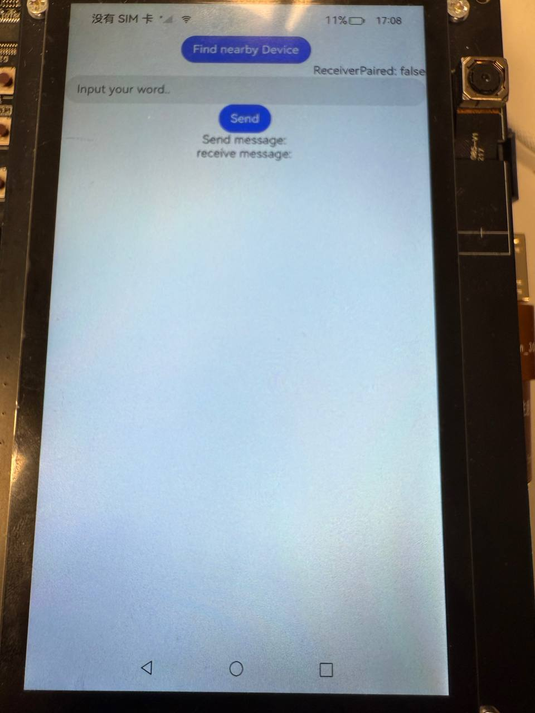

# Super Device Demo

## Content table
1. [Overview](#overview)
2. [Requirements](#requirements)
3. [Features](#features)
4. [Set Up Instruction](#set-up-instruction)
5. [Quick Start Guide](#quick-start-guide)
6. [Link](#link)

## Overview
This demo showcases a simple implementation of cross-device data synchronization using the `distributedKVStore` module in OpenHarmony. After device pairing under the same network and PIN code verification, the sender device can push messages to the receiver device through a distributed key-value store. The receiver listens for data changes and updates its state accordingly.

UI effects is as following:


> **Note:**
>
>This example involves the use of system interfaces, and you need to manually replace the Full SDK to compile successfully. For specific operations, refer to the [Replacement Guide](https://docs.oniroproject.org/application-development/environment-setup-config/full-public-sdk/).

## Requirements
- Two OpenHarmony-compatible devices(e.g. `dayu development kit` and `OpenHarmony developer phone`)
- Valid network
- Proper permissions(`ACCESS_SERVICE_DM` and `DISTRIBUTED_DATASYNC`)

## Features
- Discover nearby devices with same network
- Authenticate and pair discovered device using PIN code
- Send data from one device to another in real time

## Set Up Instruction
**1. Clone the repo**
```bash
git clone https://github.com/imansmallapple/superDeviceDemo.git
```

**2. Build and Deploy**
- Make sure you have API11
- Make sure your app is `system level` application
- Make sure you had signed signature of the application
- Connect two OpenHarmony-compatible devices(e.g. Dayu development kit and OpenHarmony Developer Phone)
- Ensure both devices are connected to the same network
- Click `run` button on DevEco Studio to install the application
>**Note:**
>
>[Tutorial](https://docs.oniroproject.org/application-development/codeLabs/) of changing project into `system level`

## Quick Start Guide
**1. Install the app on both devices**
Make sure both devices support OpenHarmony and are connected to the same network.

**2. Pair device**
- Click **Find nearby device** button.
- Select the receiver device from the pop up list.
- The other device will pop up a verification box, after permited, receiver device will generate a random PIN code, put that code into sender device.
- Pairing finished.

**3. Determine roles**
Once paired, the initiating device will be labeled as `Sender`, and the other will be labeled as `Receiver`.

**4. Send data**
- On `Sender`, enter text in the input box.
- Tap **Send** to push the message.

**5. Receive data**
- The **Receiver** will automatically receive and display the received message.

**6. Unbind if needed**
- Tap **Unbind** to disconnect the paired device and reset the session.

## Link
If you want to check more detailed code explainations, architecture deep-dives and step-by-step implementation guides, please go through this [tutorial](../tutorial.md).